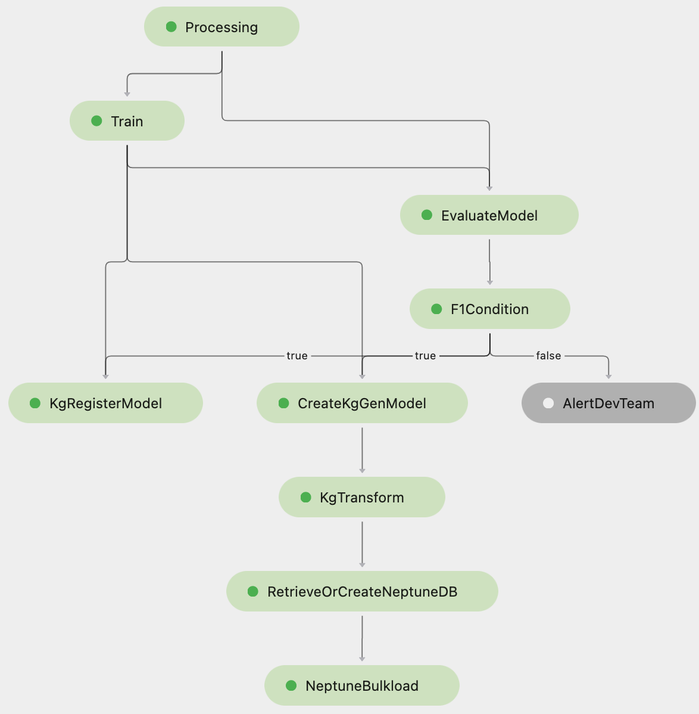

# Build an Amazon SageMaker Pipeline to Transform Raw Texts to A Knowledge Graph
This repository provides a pipeline to create a knowledge graph from raw texts. The pipeline concatenate major steps including:
- <strong>Data processing</strong>: transform labeled text data to the Subject-Predicate-Object (SPO) format
- <strong>Training</strong>: use a RNN-based algorithm to train an AI model to predict SPOs from given texts
- <strong>Create a Neptune database</strong>: if the training metric (F1-Score) passes the threshold, create a Neptune database
- <strong>Batch Transform</strong>: use the model trained in the `Training` step to do inferences on the test data
- <strong>Bulk load</strong>: transform the inference results to the format which can be recognized by the `bulkload` function of Neptune, and load the transformed data to the Neptune database.

## Prerequisites
- [Create an AWS account](https://aws.amazon.com/premiumsupport/knowledge-center/create-and-activate-aws-account/) or use an existing AWS account.
- [Create a SageMaker Notebook instance](https://docs.aws.amazon.com/sagemaker/latest/dg/howitworks-create-ws.html). When you set up the notebook instance, you need to pay attention to following configurations:
    1. IAM role: you should attach policies of `AmazonSageMakerFullAccess`, `IAMFullAccess`, `AmazonS3FullAccess`, `AmazonSNSFullAccess` and `NeptuneFullAccess` to the IAM role.
    2. Network: in order to access the Neptune database created in the pipeline, a VPC is required to run the notebook.

## Security
See [CONTRIBUTING](CONTRIBUTING.md#security-issue-notifications) for more information.

## License
This library is licensed under the MIT-0 License. See the LICENSE file.
